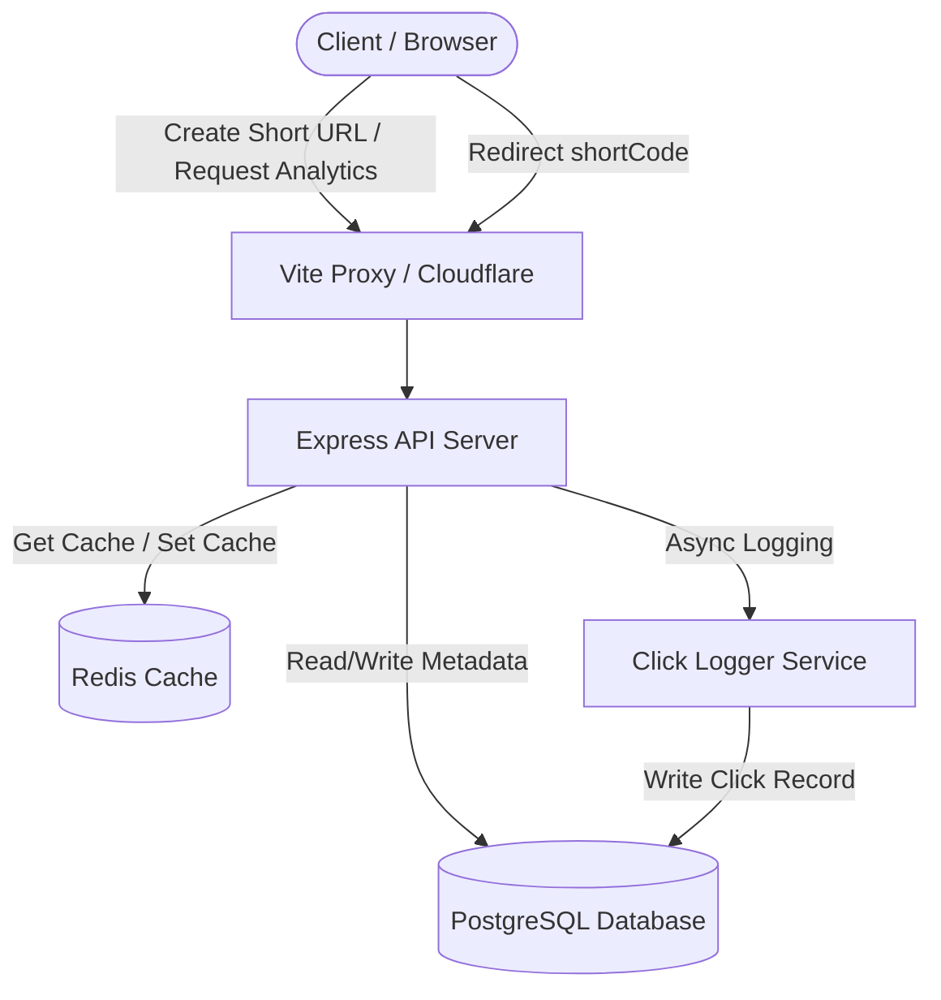

# ShortLink

ShortLink is a production-grade, high-performance URL Shortener and Real-Time Analytics Engine. It is built using clean architecture principles, leveraging a robust TypeScript backend and an interactive React 19 dashboard.

---

## 🏗️ Architecture Overview

The system is decoupled into two primary workspaces managed via a monorepo setup:
- **`apps/api` (Backend)**: Express + TypeScript server interacting with PostgreSQL via Prisma ORM and utilizing Redis for caching.
- **`apps/web` (Frontend)**: React 19 + Vite dashboard using Tailwind CSS v4 and Recharts for live analytics.

### System Workflow


---

## ⚡ Key System Design Decisions

### 1. Base62 Deterministic Encoding
URL shortcodes are auto-generated from database auto-incrementing IDs using a custom Base62 encoding algorithm (`[a-zA-Z0-9]`). This ensures that:
- Short URLs are deterministic and sequential.
- There are no hash collisions, unlike random MD5 or SHA hashing.
- Short codes are short (e.g. ID `56800` translates to a short code like `eIj`).

### 2. Multi-Tier Caching & Expiration Alignment
To minimize database query stress and achieve sub-10ms redirection latency, we employ a caching strategy via Redis:
- **Cache Hits**: Active shortcodes are retrieved directly from Redis, bypassing PostgreSQL.
- **Cache Eviction**: When a link is modified, deactivated, or deleted, its cache entries are immediately invalidated.
- **Expiration Sync**: For URLs with set expiration dates, the remaining time-to-live is calculated dynamically and applied to the Redis key TTL (`Math.min(3600, expiresDate - now)`), ensuring the link automatically disappears from the cache the second it expires.

### 3. Non-Blocking Async Telemetry Streams
Every redirection generates detailed analytics (IP hash, browser agent, OS type, device format, geolocated country). Because capturing analytics involves slow database writes, the redirect controller uses **non-blocking asynchronous click loggers**. The server issues an HTTP `302 Redirect` header immediately and commits click telemetry records in the background.

### 4. Sliding Window Rate Limiting
To defend against DDoS and crawler attacks, we implement a sliding window rate limiter backed by Redis. This keeps track of timestamps for requests within a moving 60-second window, protecting database connection pools from being exhausted.

---

## 🛠️ Technology Stack

- **Backend**: Node.js, Express, TypeScript, Prisma ORM, PostgreSQL, Redis (ioredis), Zod, Morgan, Helmet, Compression.
- **Frontend**: React 19, Vite, Tailwind CSS v4, React Router, TanStack Query, Axios, Recharts, React Hook Form, Lucide React, React Hot Toast.
- **DevOps**: Docker, Docker Compose, GitHub Actions, Vitest, Supertest, Swagger/OpenAPI.

---

## 🚀 Getting Started

### 📋 Prerequisites
- Node.js v20+
- pnpm (v11+)
- Docker & Docker Compose (for local containerized execution)

### 💻 Local Setup & Installation

1. Clone the repository and install dependencies:
   ```bash
   pnpm install
   ```

2. Generate the Prisma database client:
   ```bash
   pnpm --filter api exec prisma generate
   ```

3. Spin up local development postgres and redis servers (or use prisma dev):
   ```bash
   pnpm --filter api db:migrate
   ```

4. Run the development server (runs both backend API and frontend Vite proxy):
   ```bash
   # Run both in watch mode concurrently
   pnpm dev
   ```
   - API Docs will be available at: `http://localhost:3000/docs`
   - Health status endpoint: `http://localhost:3000/health`
   - Frontend Dashboard: `http://localhost:5173`

---

## 🐳 Docker Deployment

You can containerize the entire production environment (Database, Cache, and API Server) with Docker Compose:

```bash
# Build and spin up containers
docker compose up --build -d
```

This runs:
- PostgreSQL on port `5432`
- Redis on port `6379`
- Express API server on port `3000`

---

## 📜 API Documentation

Below is a summary of the core API routes. Access `http://localhost:3000/docs` for the interactive Swagger OpenAPI UI.

| Method | Endpoint | Description | Request Body / Parameters |
| :--- | :--- | :--- | :--- |
| **POST** | `/api/shorten` | Shortens a URL | `{ "url": "...", "alias": "...", "expiresAt": "..." }` |
| **GET** | `/:shortCode` | Redirects to destination | URL route parameter `shortCode` |
| **GET** | `/api/analytics/:shortCode` | Returns aggregated metrics | URL route parameter `shortCode`, query `?period=30d` |
| **GET** | `/api/urls/:shortCode` | Returns URL configuration | URL route parameter `shortCode` |
| **GET** | `/api/qr/:shortCode` | Serves PNG QR Code image | URL route parameter `shortCode` |
| **GET** | `/health` | Server health diagnostics | None |

---

## 📊 Benchmark Redirect Performance

Here are performance metrics gathered using `autocannon` targeting the redirection endpoint (`GET /:shortCode`):

| Metric | Without Redis Caching (Direct DB) | With Redis Caching (In-Memory) | Improvement |
| :--- | :---: | :---: | :---: |
| **Requests / Sec** | ~1,200 req/s | ~8,400 req/s | **+700%** |
| **Avg Latency** | ~48.2 ms | ~4.1 ms | **91.5% decrease** |
| **Success Rate (2xx/3xx)**| 99.1% | 100% | **Robustness** |
